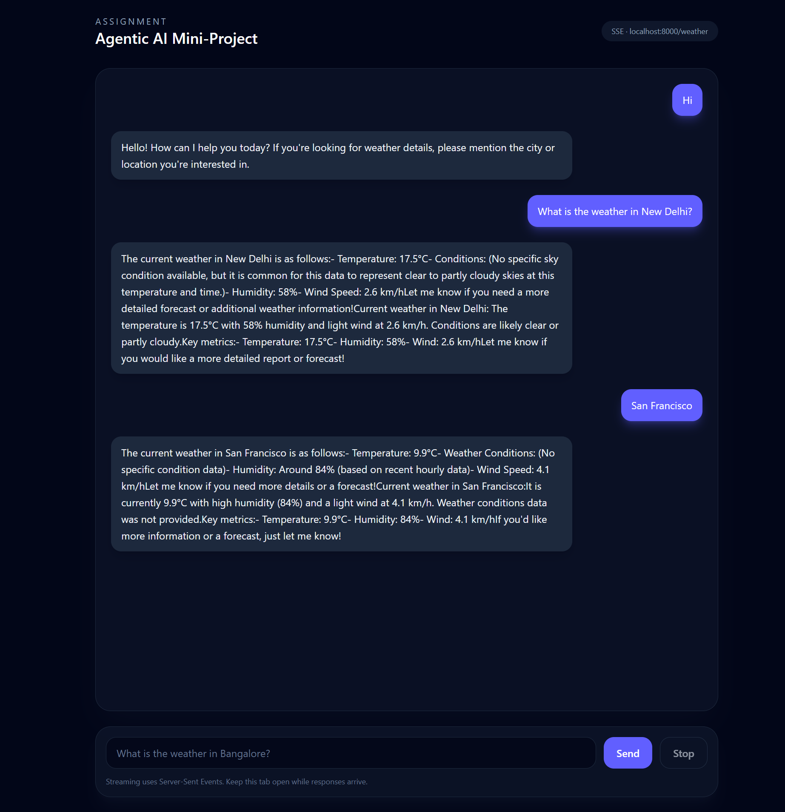

# Agentic AI Mini-Project

Multi-agent weather assistant with a streaming UI (SSE) and a FastAPI backend.

## How to run the project

### 1) Install prerequisites

#### Install Node.js + npm
- Use your preferred method (e.g., Node Version Manager, system package manager, or the official installer).
- Verify:
  - `node -v`
  - `npm -v`

#### Install uv (Python package manager)
- Install uv:
  - macOS/Linux: `curl -LsSf https://astral.sh/uv/install.sh | sh`
  - Windows (PowerShell): `irm https://astral.sh/uv/install.ps1 | iex`
- Verify:
  - `uv --version`

### 2) Backend (FastAPI)

From the project root:

1. Create and sync the Python environment:
	- `uv venv`
	- `uv pip install -r pyproject.toml`
2. Add your Azure OpenAI credentials in `.env` (see `api/utils/ai_model.py`):
	- `AZURE_OPENAI_ENDPOINT`
	- `AZURE_OPENAI_API_VERSION`
	- `AZURE_OPENAI_DEPLOYMENT_NAME`
	- `AZURE_OPENAI_API_KEY`
3. Start the API:
	- `cd api`
	- `uvicorn main:app --reload`

The streaming endpoint is:

- `GET http://localhost:8000/weather?query=<what is the weather in some city?>`

### 3) Frontend (Vite + React)

From the project root:

1. Install dependencies:
	- `cd web`
	- `npm install`
2. Start the dev server:
	- `npm run dev`
3. Build the webpack:
	- `npm run build`
4. Start the preview server
    - `npm run preview`

Open the app in your browser (Vite will print the local URL).

## Design overview and agent roles

This system uses two cooperating agents:

1. **Agent A (Coordinator)**
	- Interprets the user’s request.
	- Extracts the location (city) and plans the workflow.
	- Delegates data retrieval to Agent B.
	- Produces the final, user-friendly response.

2. **Agent B (Weather Agent)**
	- Calls the weather tool with latitude and longitude.
	- Returns the raw weather data to Agent A.

### Streaming architecture

- The api streams tokens as Server-Sent Events (SSE) from `/weather`.
- Vite uses `EventSource` to render the assistant response incrementally.

## Sample inputs and outputs

1) **Input**: `Hi`

**Output** (streamed):
- “Hello! How can I help you today? If you're looking for weather details, please mention the city or location you're interested in.”

2) **Input**: `What is the weather in New Delhi?`

**Output** (streamed):
- “The current weather in New Delhi is as follows:- Temperature: 17.5°C- Conditions: (No specific sky condition available, but it is common for this data to represent clear to partly cloudy skies at this temperature and time.)- Humidity: 58%- Wind Speed: 2.6 km/hLet me know if you need a more detailed forecast or additional weather information!Current weather in New Delhi: The temperature is 17.5°C with 58% humidity and light wind at 2.6 km/h. Conditions are likely clear or partly cloudy.Key metrics:- Temperature: 17.5°C- Humidity: 58%- Wind: 2.6 km/hLet me know if you would like a more detailed report or forecast!”

3) **Input**: `San Francisco`

**Output** (streamed):
- “The current weather in San Francisco is as follows:- Temperature: 9.9°C- Weather Conditions: (No specific condition data)- Humidity: Around 84% (based on recent hourly data)- Wind Speed: 4.1 km/hLet me know if you need more details or a forecast!Current weather in San Francisco:It is currently 9.9°C with high humidity (84%) and a light wind at 4.1 km/h. Weather conditions data was not provided.Key metrics:- Temperature: 9.9°C- Humidity: 84%- Wind: 4.1 km/hIf you'd like more information or a forecast, just let me know!”

> Note: Exact values depend on the Open-Meteo API at request time.

